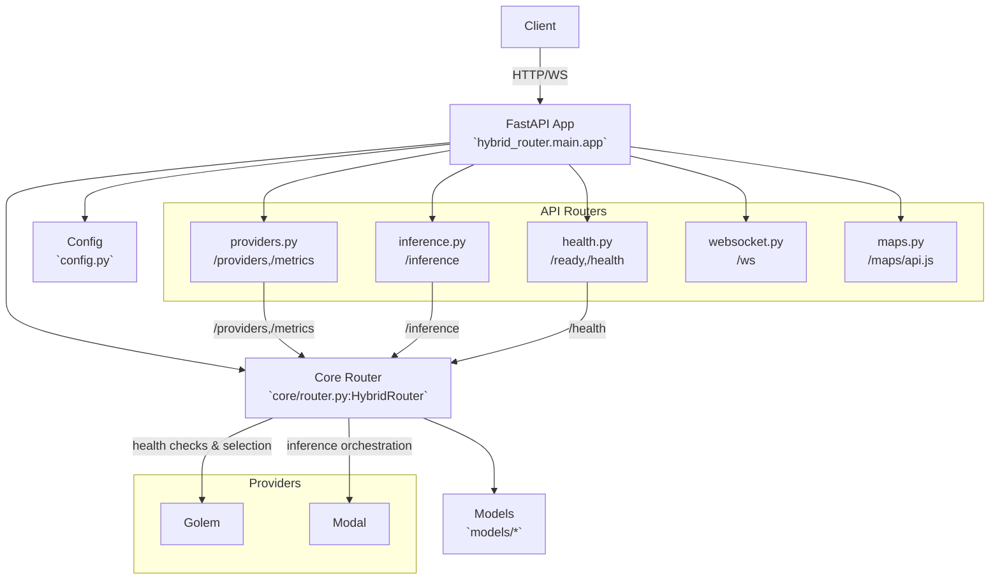
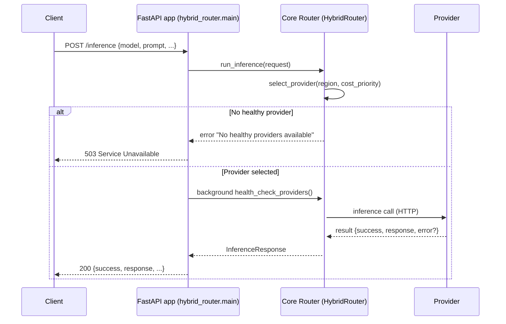

# Project Beacon Website + Docs

This repo serves a static landing page at `/` and a Docusaurus v3 docs site at `/docs` on the same Netlify deployment.

## Structure
- `index.html`, `styles.css`, `script.js`, `images/` — one-pager landing site
- `docs/` — Docusaurus site root
  - `docs/docs/**` — documentation content
  - `docs/blog/**` — blog posts
  - `docs/docusaurus.config.ts` — Docusaurus config (baseUrl `/docs/`)
  - `docs/sidebars.ts` — sidebars

## Build & Deploy
Netlify uses `netlify.toml` to:
- Run `npm run build`
- Publish `dist/`
- Route `/docs/*` to the built Docusaurus SPA (`/docs/index.html`)

Unified build:
```bash
npm install
npm run build
```
Outputs:
- `dist/` — landing page + docs under `dist/docs/`

Standalone docs (for IPFS pinning):
```bash
npm run build:docs:standalone
# Output: dist-docs-standalone/ (baseUrl "/")
```

## Local Development
Run both landing and docs:
```bash
npm run dev
# Landing: http://localhost:3000
# Docs:    http://localhost:3001/docs/
```

## Versioning
Enable versioning (creates `docs/versioned_docs` and `docs/versions.json`):
```bash
npm run version
```

## Build Metadata in Docs Footer
The docs footer shows:
- Commit: `COMMIT_REF` (from Netlify)
- CID: `DOCS_BUILD_CID` (optional env var)

Set in Netlify (optional):
- `DOCS_BUILD_CID = bafy...`

## Hybrid Router (API)
The repository also contains a FastAPI-based hybrid router that multiplexes requests across providers.

### Run locally
```bash
python -m hybrid_router.main
# or
uvicorn hybrid_router.main:app --host 0.0.0.0 --port 8000
```

### Core endpoints
- `/ready` — lightweight readiness probe
- `/health` — includes provider counts and regions
- `/providers` — list providers and status (optional `?region=...`)
- `/metrics` — aggregate latency/success and `models_supported`
- `/inference` — POST inference requests
- `/ws` — WebSocket endpoint for realtime messages
- `/maps/api.js` — Google Maps JS proxy (prevents key exposure)

### Environment variables
- `GOLEM_PROVIDER_ENDPOINTS` — comma-separated base URLs
- `MODAL_API_BASE` — Modal HTTP endpoint
- `MODAL_HEALTH_ENDPOINT` — Modal health check URL
- `GOOGLE_MAPS_API_KEY` — required for `/maps/api.js`
- `PORT` — server port (defaults to 8000)

### Docker
Dockerfile is at `Website/Dockerfile` and starts the modular app.
```bash
docker build -t beacon-router Website
docker run --rm -e PORT=8000 -p 8000:8000 beacon-router
```
Container healthcheck tries `/health` and falls back to `/ready` on `:${PORT:-8000}`.

### Tests
```bash
pytest -q
```

### Architecture


### Inference flow (sequence)

