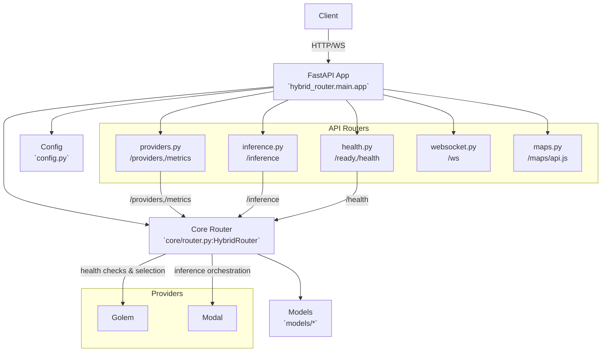

# Hybrid Router Runbook

The hybrid router is a FastAPI app that routes inference requests across multiple providers. The modular app entrypoint is `hybrid_router/main.py`.

- App module: `hybrid_router.main`
- Core Logic: `hybrid_router/core/router.py`
- Routers: `hybrid_router/api/`
- Models: `hybrid_router/models/`
- Config: `hybrid_router/config.py`
- Dockerfile: `Website/Dockerfile`

## Architecture

 ## Run locally
 ```bash
 # Option 1: Python module
 python -m hybrid_router.main

# Option 2: Uvicorn
uvicorn hybrid_router.main:app --host 0.0.0.0 --port 8000
```
- `GET /ready` — lightweight readiness probe
- `GET /health` — overall health: provider counts, regions
- `GET /providers` — provider status (optional `?region=...`)
- `GET /metrics` — aggregate latency, success rate, and `models_supported`
- `POST /inference` — run inference
- `GET /ws` — HTTP hint for WebSocket
- `WS /ws` — WebSocket endpoint (real-time messages)
- `GET /maps/api.js` — Google Maps JavaScript proxy (prevents key exposure)

## Environment variables
- `GOLEM_PROVIDER_ENDPOINTS` — comma-separated provider base URLs
- `MODAL_API_BASE` — Modal HTTP endpoint
- `MODAL_HEALTH_ENDPOINT` — health endpoint used for Modal checks
- `GOOGLE_MAPS_API_KEY` — required for `/maps/api.js`
- `PORT` — server port (default: 8000)

CORS origins are configured in `hybrid_router/config.py` via `CORS_ORIGINS`.

## Docker
Dockerfile is located at `Website/Dockerfile` and starts the modular app.

```bash
docker build -t beacon-router Website
# Expose port 8000 (or set PORT env var to override)
docker run --rm -e PORT=8000 -p 8000:8000 beacon-router
```

Container healthcheck:
- Tries `GET /health` first
- Falls back to `GET /ready`
- Uses `:${PORT:-8000}` inside the container

## Deployment notes
- The app binds to `0.0.0.0` and reads `PORT` from the environment.
- Ensure provider env vars are present in the hosting platform (e.g., Railway).
- The Dockerfile copies the entire `Website/` directory to ensure the `hybrid_router/` package is available.

## Smoke checks
```bash
# Readiness and health
curl -sf http://localhost:8000/ready
curl -sf http://localhost:8000/health

# Providers and metrics
curl -sf http://localhost:8000/providers | jq .
curl -sf http://localhost:8000/metrics | jq .

# Inference (example)
curl -s -X POST http://localhost:8000/inference \
  -H 'content-type: application/json' \
  -d '{
    "model": "llama3.2-1b",
    "prompt": "Hello from runbook",
    "temperature": 0.1,
    "max_tokens": 64
  }' | jq .
```

## Troubleshooting
- Healthcheck fails:
  - Verify `PORT` matches the exposed port.
  - Check env vars for providers (e.g., `MODAL_API_BASE`, `GOLEM_PROVIDER_ENDPOINTS`).
  - Inspect logs for provider health checks.
- CORS errors:
  - Update `CORS_ORIGINS` in `hybrid_router/config.py` to include your frontend origin.
- Maps proxy returns 500:
  - Ensure `GOOGLE_MAPS_API_KEY` is set.
- WebSocket issues:
  - Ensure you are using a proper WS client on `/ws` (HTTP GET returns a helpful hint).

## Tests
Run the test suite:
```bash
pytest -q
```
- Smoke tests validate `/ready`, `/health`, `/providers`, `/metrics`.
- Additional tests ensure the app imports and titles are correct.
