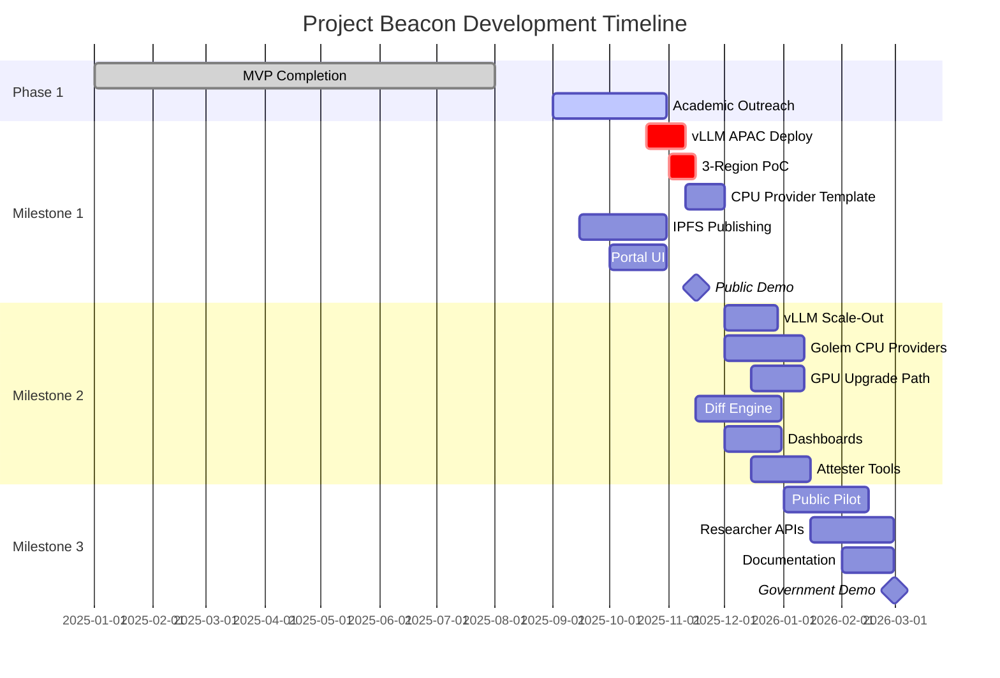

## Project Timeline (6 Months)

### Current Status
- **MVP Completed**: Phase 1 infrastructure and basic functionality operational
- **Multi-region deployment**: Hybrid infrastructure across US-East, EU-West, Asia-Pacific
- **Ready for**: Academic engagement and community building

### Milestone 1: Vertical Slice (Months 0-2)
**Deliverables:**
- **vLLM APAC Deployment**: Fix APAC region reliability (target >95% success rate)
- **3-Region Proof of Concept**: Demonstrate cross-region bias detection (US + EU + APAC)
- **CPU Provider Template**: Standardized vLLM deployment for Golem providers (CPU-first strategy)
- IPFS bundles and Merkle root publishing
- Portal UI showing proofs and live activity
- Public demo and comprehensive documentation
- Academic outreach and initial university partnerships

**Key Dependencies:**
- **vLLM Integration**: APAC warmup time reduction (<500ms target) - CRITICAL PATH
- **Provider Onboarding**: CPU-capable Golem providers (GPU optional for premium tier)
- IPFS integration and CID publishing workflow
- Academic calendar alignment (September-October engagement window)

### Milestone 2: Multi-Region + Diff Engine (Months 2-4)
**Deliverables:**
- **vLLM Scale-Out**: Deploy vLLM to all regions (US + EU + APAC)
- **Golem Provider Network**: 5-10 CPU providers operational across regions
- **GPU Upgrade Path**: 2-3 providers upgraded to GPU vLLM (premium tier)
- ≥3 regions orchestrated with retries/backoff
- Cross-region output comparison and diff visualizations
- Result aggregator and monitoring dashboards
- Attester monitoring tools integration
- Provider deployment pattern documentation

**Key Dependencies:**
- **vLLM Production Stability**: All regions on vLLM with <500ms latency
- Regional provider availability and reliability
- Cross-region networking and coordination
- Diff engine algorithm validation

### Milestone 3: Public Pilot + Researcher UX (Months 4-6)
**Deliverables:**
- Stable public portal with researcher APIs
- Published datasets and analysis tutorials
- Academic project templates and examples
- Government engagement demonstrations
- Community maintenance transition plan

**Key Dependencies:**
- Academic partnership maturation
- Government stakeholder engagement
- Community adoption and feedback integration

## Extended Roadmap (Beyond 6 Months)

### Phase 4: Mac Yagna Development (Months 6-12)
- Native macOS Golem provider client development
- Mac hardware integration (Metal GPU, Secure Enclave)
- Provider onboarding and testing infrastructure
- Performance optimization and security hardening

### Phase 5: Geographic Proof System (Months 12-18)
- ZK circuit development using Aztec/Noir framework
- Multi-oracle geographic consensus implementation
- Secure Enclave integration for location attestation
- Blockchain verification and smart contract deployment
- Enterprise compliance framework development

### Phase 6: Government Integration (Months 18-21)
- Policy maker engagement with verified compute demonstrations
- Regulatory compliance frameworks using geographic proofs
- International conference presentations
- High-security government pilot programs

## Gantt Chart

## Risk Mitigation Timeline
- **Month 1**: vLLM APAC deployment and 3-region proof of concept validation (CRITICAL PATH)
- **Month 2**: CPU provider onboarding and template standardization; backup Modal/RunPod infrastructure
- **Month 3**: GPU upgrade path validation; community feedback integration
- **Month 4**: Multi-provider orchestration stability; government stakeholder engagement planning
- **Month 5**: International scaling preparation and conference submissions
- **Month 6**: Sustainability model validation and transition planning

## Technical Priorities

### Immediate (Weeks 1-3)
1. **vLLM APAC Deployment**: Fix region reliability to enable 3-region demos
2. **Proof of Concept Validation**: Demonstrate cross-region bias detection working end-to-end
3. **Performance Benchmarking**: Document latency, cost, and success rate improvements

### Short-term (Months 1-2)
1. **CPU Provider Template**: Standardize vLLM deployment for Golem providers
2. **Provider Onboarding**: Recruit and deploy 3-5 CPU providers across regions
3. **Documentation**: Create comprehensive provider deployment guides

### Medium-term (Months 2-4)
1. **vLLM Scale-Out**: Migrate all regions to vLLM infrastructure
2. **GPU Upgrade Path**: Enable premium tier for providers with GPU capacity
3. **Multi-Provider Orchestration**: Validate hybrid CPU/GPU routing and failover

See `vllm-plan.md` for detailed technical implementation plan.
