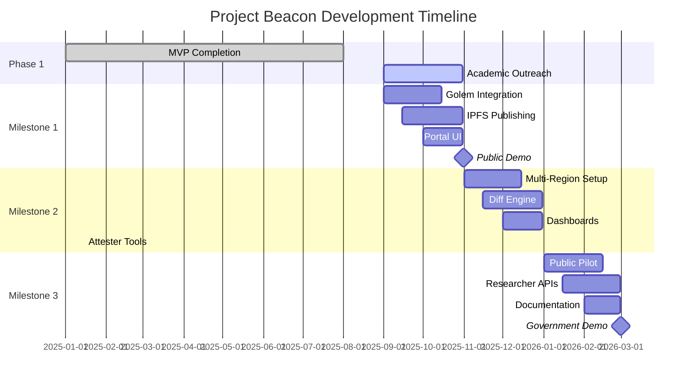

## Project Timeline (6 Months)

### Current Status
- **MVP Completed**: Phase 1 infrastructure and basic functionality operational
- **Multi-region deployment**: Hybrid infrastructure across US-East, EU-West, Asia-Pacific
- **Ready for**: Academic engagement and community building

### Milestone 1: Vertical Slice (Months 0-2)
**Deliverables:**
- Single-region execution fully operational on Golem
- IPFS bundles and Merkle root publishing
- Portal UI showing proofs and live activity
- Public demo and comprehensive documentation
- Academic outreach and initial university partnerships

**Key Dependencies:**
- Golem provider onboarding and configuration
- IPFS integration and CID publishing workflow
- Academic calendar alignment (September-October engagement window)

### Milestone 2: Multi-Region + Diff Engine (Months 2-4)
**Deliverables:**
- ≥3 regions orchestrated with retries/backoff
- Cross-region output comparison and diff visualizations
- Result aggregator and monitoring dashboards
- Attester monitoring tools integration
- Provider deployment pattern documentation

**Key Dependencies:**
- Regional provider availability and reliability
- Cross-region networking and coordination
- Diff engine algorithm validation

### Milestone 3: Public Pilot + Researcher UX (Months 4-6)
**Deliverables:**
- Stable public portal with researcher APIs
- Published datasets and analysis tutorials
- Academic project templates and examples
- Government engagement demonstrations
- Community maintenance transition plan

**Key Dependencies:**
- Academic partnership maturation
- Government stakeholder engagement
- Community adoption and feedback integration

## Extended Roadmap (Beyond 6 Months)

### Phase 4: Mac Yagna Development (Months 6-12)
- Native macOS Golem provider client development
- Mac hardware integration (Metal GPU, Secure Enclave)
- Provider onboarding and testing infrastructure
- Performance optimization and security hardening

### Phase 5: Geographic Proof System (Months 12-18)
- ZK circuit development using Aztec/Noir framework
- Multi-oracle geographic consensus implementation
- Secure Enclave integration for location attestation
- Blockchain verification and smart contract deployment
- Enterprise compliance framework development

### Phase 6: Government Integration (Months 18-21)
- Policy maker engagement with verified compute demonstrations
- Regulatory compliance frameworks using geographic proofs
- International conference presentations
- High-security government pilot programs

## Gantt Chart

## Risk Mitigation Timeline
- **Month 1**: Academic calendar alignment and university partnership establishment
- **Month 2**: Provider reliability assessment and backup infrastructure
- **Month 3**: Community feedback integration and feature prioritization
- **Month 4**: Government stakeholder identification and engagement planning
- **Month 5**: International scaling preparation and conference submissions
- **Month 6**: Sustainability model validation and transition planning
