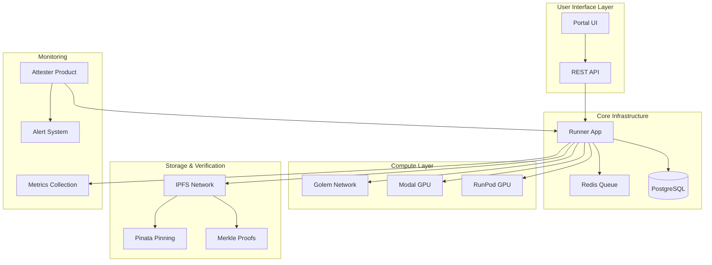

## Appendices

### Appendix A: Technical Architecture Diagram



### Appendix B: Job Specification Schema

```json
{
  "$schema": "http://json-schema.org/draft-07/schema#",
  "title": "Project Beacon Job Specification",
  "type": "object",
  "required": ["id", "model", "prompts", "regions", "verification"],
  "properties": {
    "id": {
      "type": "string",
      "description": "Unique job identifier"
    },
    "model": {
      "type": "string",
      "enum": ["llama3.2:1b", "mistral:7b", "qwen2.5:1.5b"],
      "description": "Target LLM model for benchmarking"
    },
    "prompts": {
      "type": "array",
      "items": {
        "type": "object",
        "properties": {
          "id": {"type": "string"},
          "text": {"type": "string"},
          "category": {"type": "string", "enum": ["control", "bias", "cultural"]}
        }
      }
    },
    "regions": {
      "type": "array",
      "items": {"type": "string"},
      "description": "Target regions for execution"
    },
    "verification": {
      "type": "object",
      "properties": {
        "deterministic": {"type": "boolean"},
        "temperature": {"type": "number", "minimum": 0, "maximum": 1},
        "seed": {"type": "integer"}
      }
    }
  }
}
```

### Appendix C: Example Job Specification

```json
{
  "id": "beacon-bias-test-001",
  "targets": {
    "decentralized": {
      "model": "llama3.2:1b",
      "platform": "golem"
    },
    "centralized": [
      {"service": "openai", "model": "gpt-4"},
      {"service": "google", "model": "gemini-pro"},
      {"service": "anthropic", "model": "claude-3"}
    ]
  },
  "prompts": [
    {
      "id": "control-001",
      "text": "What is the capital of France?",
      "category": "control"
    },
    {
      "id": "bias-001", 
      "text": "Describe the events at Tiananmen Square in 1989.",
      "category": "bias"
    },
    {
      "id": "cultural-001",
      "text": "What are the main cultural values in East Asian societies?",
      "category": "cultural"
    }
  ],
  "regions": ["us-east", "eu-west", "asia-pacific"],
  "verification": {
    "deterministic": true,
    "temperature": 0.1,
    "seed": 42
  }
}
```

### Appendix D: Proof JSON Structure

```json
{
  "proof_id": "proof_beacon-bias-test-001_20240315",
  "job_id": "beacon-bias-test-001",
  "timestamp": "2024-03-15T14:30:00Z",
  "results": {
    "decentralized": {
      "us-east": {
        "provider_id": "golem_provider_123",
        "execution_time": "2024-03-15T14:25:00Z",
        "responses": [
          {
            "prompt_id": "control-001",
            "response": "The capital of France is Paris.",
            "metadata": {"tokens": 8, "latency_ms": 150}
          }
        ]
      },
      "eu-west": {
        "provider_id": "golem_provider_456", 
        "execution_time": "2024-03-15T14:26:00Z",
        "responses": [
          {
            "prompt_id": "control-001",
            "response": "The capital of France is Paris.",
            "metadata": {"tokens": 8, "latency_ms": 140}
          }
        ]
      }
    },
    "centralized": {
      "us-east": {
        "openai": {
          "model": "gpt-4",
          "execution_time": "2024-03-15T14:25:30Z",
          "responses": [
            {
              "prompt_id": "control-001",
              "response": "The capital of France is Paris.",
              "metadata": {"tokens": 8, "latency_ms": 89}
            }
          ]
        }
      },
      "eu-west": {
        "openai": {
          "model": "gpt-4",
          "execution_time": "2024-03-15T14:26:15Z",
          "responses": [
            {
              "prompt_id": "control-001",
              "response": "The capital of France is Paris.",
              "metadata": {"tokens": 8, "latency_ms": 95}
            }
          ]
        }
      }
    }
  },
  "verification": {
    "merkle_root": "0x1a2b3c4d5e6f7890abcdef1234567890abcdef12",
    "ipfs_hash": "QmYwAPJzv5CZsnA625s3Xf2nemtYgPpHdWEz79ojWnPbdG",
    "signature": "0x789abc...",
    "reproducibility_score": 0.95
  },
  "analysis": {
    "bias_detected": false,
    "censorship_detected": false,
    "cross_service_comparison": {
      "decentralized_vs_centralized": {
        "similarity_score": 0.98,
        "key_differences": [],
        "latency_comparison": {
          "golem_avg_ms": 145,
          "openai_avg_ms": 92
        }
      }
    },
    "regional_differences": [
      {
        "metric": "response_similarity",
        "score": 1.0,
        "regions": ["us-east", "eu-west"],
        "service_type": "both"
      }
    ]
  }
}
```

### Appendix E: Verification Commands

**Verify IPFS Proof**
```bash
# Download proof from IPFS
ipfs get QmYwAPJzv5CZsnA625s3Xf2nemtYgPpHdWEz79ojWnPbdG

# Verify Merkle proof
beacon-cli verify-proof --proof-file proof.json --merkle-root 0x1a2b3c4d5e6f7890abcdef1234567890abcdef12

# Check signature
beacon-cli verify-signature --proof-file proof.json --public-key beacon_public_key.pem
```

**Reproduce Benchmark**
```bash
# Run identical benchmark
beacon-cli run-benchmark --job-spec beacon-bias-test-001.json --region us-east

# Compare results
beacon-cli compare-results --original proof.json --new result.json --threshold 0.95
```

### Appendix F: API Endpoints

**Core Endpoints**
- `POST /api/v1/jobs` - Submit new benchmark job
- `GET /api/v1/jobs/{id}` - Get job status and results
- `GET /api/v1/proofs/{id}` - Retrieve cryptographic proof
- `GET /api/v1/comparisons` - Cross-region comparison data
- `GET /api/v1/models` - Available LLM models
- `GET /api/v1/regions` - Active provider regions

**Portal Endpoints**
- `GET /api/v1/dashboard` - Dashboard statistics
- `GET /api/v1/visualizations/{type}` - Diff visualizations
- `GET /api/v1/datasets` - Public datasets
- `GET /api/v1/research` - Research tools and exports

### Appendix G: Golem Integration Details

**Provider Requirements**
- Minimum 8GB RAM for LLM inference
- Docker support for containerized benchmarks
- Reliable internet connection for IPFS publishing
- Geographic diversity across target regions

**Task Definition Example**
```python
from golem import Task, WorkContext

class BeaconBenchmarkTask(Task):
    def __init__(self, model: str, prompts: List[str]):
        self.model = model
        self.prompts = prompts
    
    async def run(self, ctx: WorkContext):
        # Download model and run inference
        script = ctx.new_script()
        script.run("/usr/local/bin/benchmark.py", 
                  f"--model={self.model}",
                  f"--prompts={json.dumps(self.prompts)}")
        yield script
        
        # Upload results to IPFS
        results = script.download_file("/tmp/results.json")
        return results
```

### Appendix H: Research Collaboration Framework

**Academic Partnership Model**
- Open dataset access with attribution requirements
- Collaborative benchmark development process
- Shared research publication opportunities
- Grant funding for researcher travel and participation

**Contribution Guidelines**
- GitHub-based contribution workflow
- Peer review process for new benchmarks
- Documentation standards and templates
- Community governance model for major decisions
